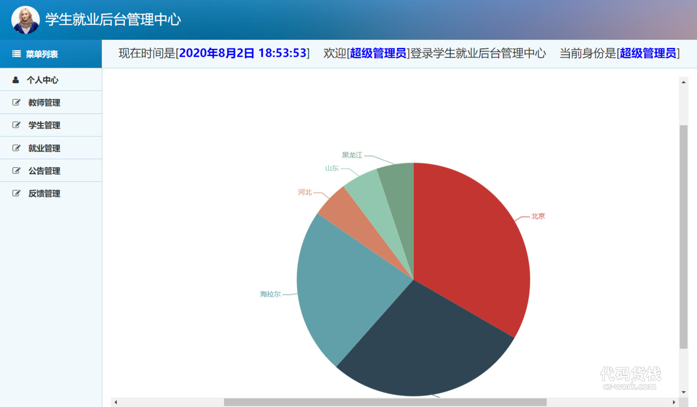
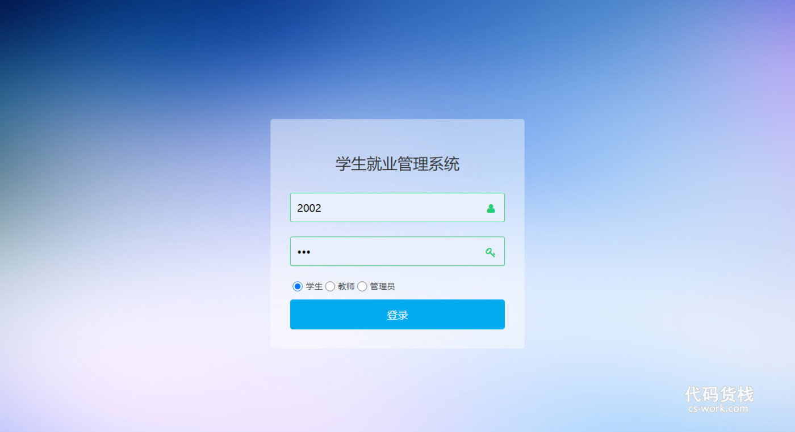
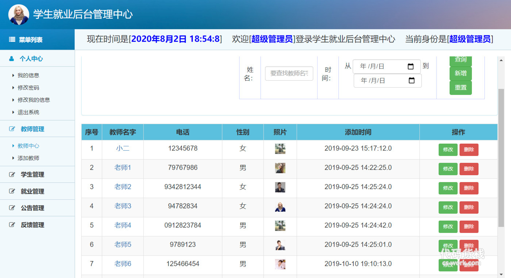
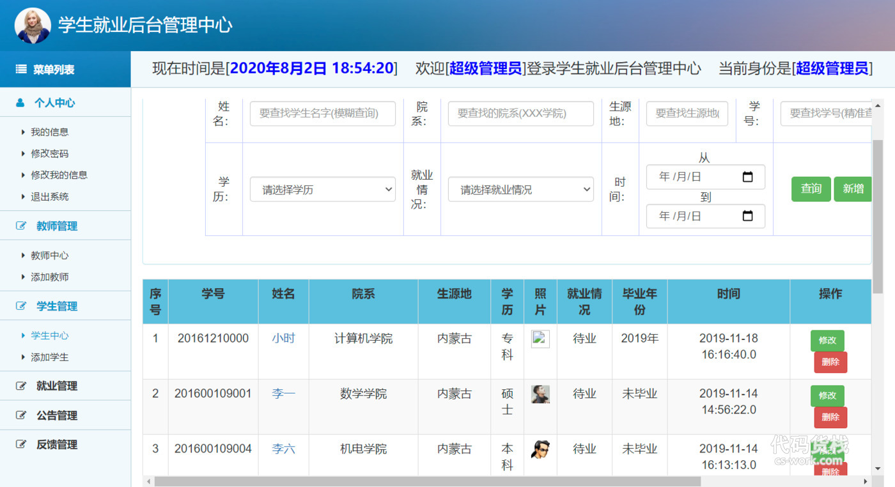
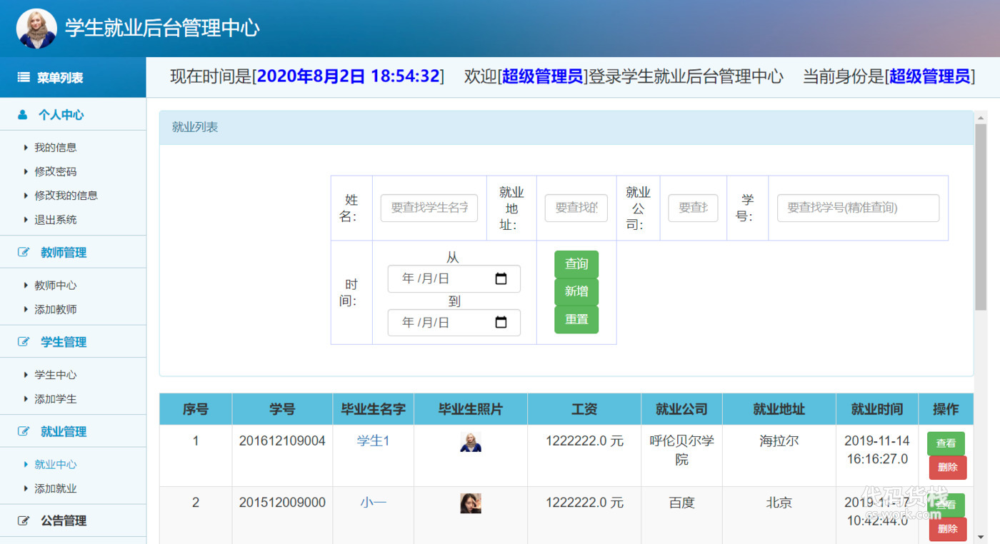
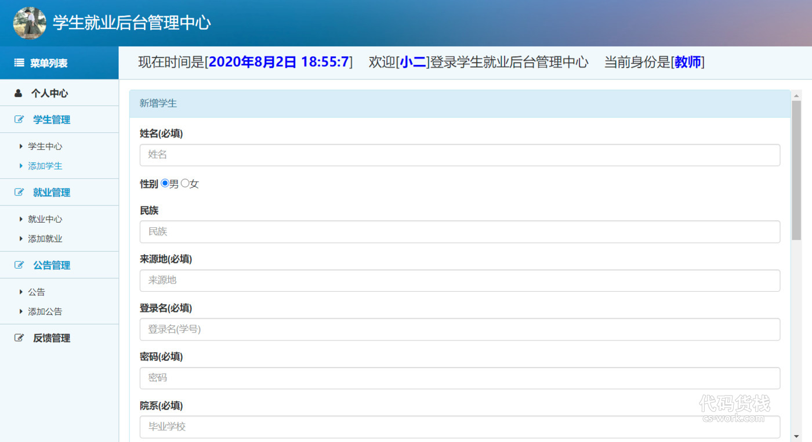
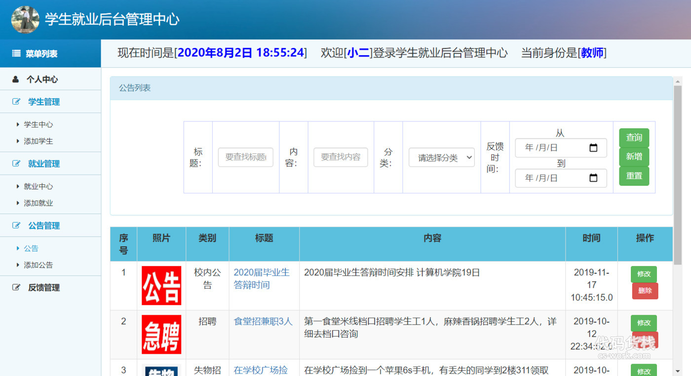

基于SSM的高校学生就业管理系统
=
### 完整代码获取地址：从戎源码网 ([https://armycodes.com/](https://armycodes.com/))
### 作者微信：19941326836  QQ：952045282 
### 承接计算机毕业设计、Java毕业设计、Python毕业设计、深度学习、机器学习
### 选题+开题报告+任务书+程序定制+安装调试+论文+答辩ppt 一条龙服务
### 所有选题地址https://github.com/nature924/allProject

一、项目介绍
---
基于SSM框架实现的高校学生就业管理系统包含两种角色：学生、管理员、教师三个角色,系统分为前台和后台两大模块，主要功能如下。

### 

【学生】
个人中心：我的信息、修改密码、修改个人信息、退出系统
就业中心、公告、反馈
###
【教师】：
1. 个人中心：教师可以查看和修改个人信息，包括姓名、联系方式等。
2. 学生管理：教师可以管理学生的信息，包括查看学生信息、编辑学生信息和删除学生信息。
3. 就业管理：教师可以管理学生的就业情况，包括查看学生的就业信息、添加学生的就业信息和编辑学生的就业信息。
4. 公告管理：教师可以发布、编辑和删除系统公告，通知学生和其他教师。
5. 反馈管理：教师可以查看学生的反馈信息，对反馈进行处理和回复。
###
【超级管理员】：
1. 菜单列表：超级管理员可以查看系统的菜单列表，包括各个模块的功能。
2. 个人中心：超级管理员可以查看和修改个人信息，包括姓名、联系方式等。
3. 教师管理：超级管理员可以管理教师的信息，包括添加、编辑和删除教师信息。
4. 学生管理：超级管理员可以管理学生的信息，包括添加、编辑和删除学生信息。
5. 就业管理：超级管理员可以管理学生的就业情况，包括查看就业信息、添加就业信息和编辑就业信息。
6. 公告管理：超级管理员可以发布、编辑和删除系统公告，通知教师和学生。
7. 反馈管理：超级管理员可以查看用户的反馈信息，对反馈进行处理和回复。

二、项目技术
---
- 编程语言：Java
- 数据库：MySQL
- 项目管理工具：Maven
- 前端技术：JSP、HTML、Jquery、Layui、ECharts
- 后端技术：Spring、SpringMVC、MyBatis

三、运行环境
---
- 操作系统：Windows、macOS都可以
- JDK版本：JDK1.8以上都可以
- 开发工具：IDEA、Ecplise、Myecplise都可以
- 数据库: MySQL5.7以上都可以
- Tomcat：任意版本都可以
- Maven：任意版本都可以

四、运行截图
---

### 程序截图：

